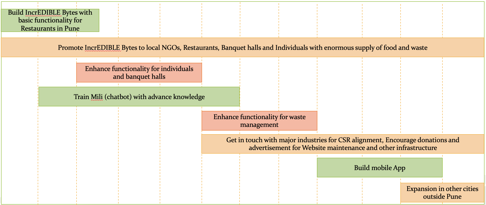

# IncrEdiblebytes

IncreEDIBLE Bytes is a platform which will end the hunger related problems by reducing food waste and provide more channels for the restaurants, individuals, banquets, etc. to post regarding surfeit food.  

In addition, our aim is to convert non edible food waste coming from restaurants to Organic Fertilizers creating economic and environmental benefits, which can improve soil health, help reduce erosion, and improve water quality.

## Contents

- [Submission or project name](#submission-or-project-name)
  - [Contents](#contents)
  - [Short description](#short-description)
    - [What's the problem?](#whats-the-problem)
    - [How can technology help?](#how-can-technology-help)
    - [The idea](#the-idea)
  - [Demo video](#demo-video)
  - [Long description](#long-description)
  - [Project roadmap](#project-roadmap)
  - [Getting started](#getting-started)
  - [Built with](#built-with)
  - [Contributing](#contributing)
  - [Authors](#authors)
  - [License](#license)

## Short description

### What's the problem?

Hunger is a continuous disaster for large parts of our population. Our country is home to 25 percent of the world's hungry population. As per the Global Hunger Index report 2020 India ranked 94 out of 107 countries - with the hunger level in the country categorized as "SERIOUS”. Coronavirus exacerbates India's hunger problem as many people have lost their jobs, and those with low incomes complain about food insecurity.
40% of the waste in our landfill is food and green organic waste. Food waste is nothing but the food we throw in the bins, in edible or inedible form.

### How can technology help?

A platform for restaurants, banquet halls and Individuals to post about the excess food. A platform for NGOs to connect with such restaurants and Individuals and collect the food. NGOs can supply the collected food to the people in need. People can use this stage to post about the non edible food waste. Agri communities can connect and collect the food waste to convert it into organic compost. Those who want to help by donations can do that by using Fund Raiser option.

### The idea

Idea came up when we saw leftover food from restaurants getting dumped in landfills, especially when big chunk of our population is struggling to get a single meal. Thought process started and we brought together a bunch of tech savvy people to device the solution to tackle these issues. And the journey started for IncrEDIBLE Bytes. 

## Demo video

## Long description

[More detail is available here](./Description.md)

## Project roadmap

The project currently does the following things.

- Registering food donors and post their food availability.
- Registering food receivers who can order food from donors.
- Lists of various restaurants and NGOs.

See below for our proposed schedule on next steps after Call for Code 2021 submission.

## Getting started

Steps to run the project:-

- Clone the project [git clone https://github.com/rajput-tripti/incredibleBytes.git]
- Run npm install
- Run ng serve -o

Prerequisites :-
- Node.js installed on the machine.
- Visual Studio code as IDE (optional).
- Install angular-cli.

## Built with

- [IBM Cloudant](https://cloud.ibm.com/catalog?search=cloudant#search_results) - The NoSQL database used
- [IBM Cloud Functions](https://cloud.ibm.com/catalog?search=cloud%20functions#search_results) - The compute platform for handing logic
- [Angular 12](https://angular.io/) - The web framework used
- [IBM Watson](https://www.ibm.com/in-en/watson) - Framework for chatbot - Mili

## Contributing

Contribute to this open-source project via [github](https://github.com/rajput-tripti/incredibleBytes)

## Authors

- **Tripti Rajput** - [rajput-tripti](https://github.com/rajput-tripti/)
- **Yashasvi Wankhede** 
- **Shalaka Bhatt** 
- **Rajni Saini**
- **Shrutika Birje**

## License

This is an open source project. Editing and contributions to this project wont require any license. 
